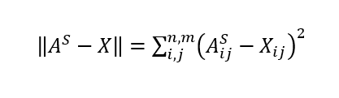
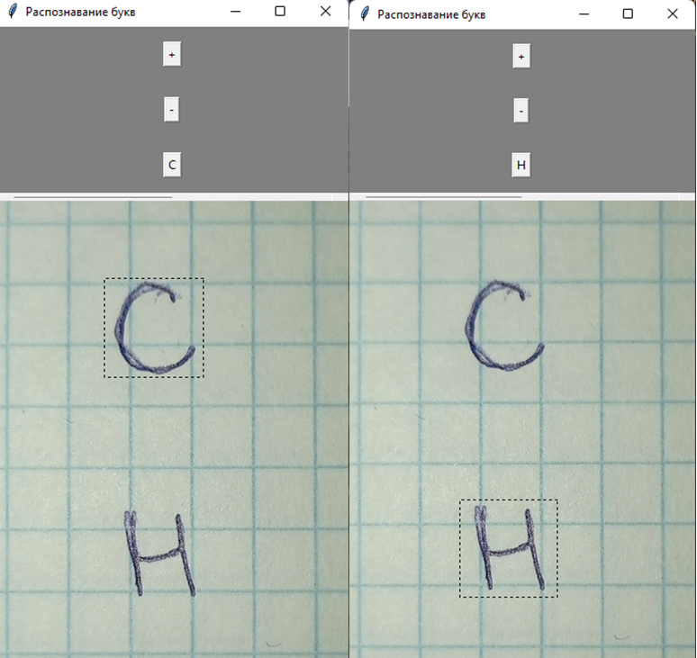

# letters-scanner

Курсовая работа. Псевдо-распознавание символов на основе сравнения их с эталонными образами.  
Сравнение проводится по формуле: 
  
Пример перевода изображения в двоичную матрицу: 

## Инструкция
Надо установить все пакеты которые хочет пайтон. Меняете photo.jpg в папке на нужную фотку, запускаете guiapp.py, наводите на букву и нажимаете на кнопку "Here!". Текст этой кнопки изменится на предположение, какая это буква. Если ваша фотка полностью черной кистью на белом фоне и не нуждается в применении фильтров, то измените значение DOFILTER на False в config.py. ВНИМАНИЕ: Убедитесь что выделение точно по середине и полностью покрывает границы буквы, оставляя совсем чуть-чуть пикселей по сторонам (Пример смотрите ниже).  
  
Надо запустить generator.py если нужны "эталонные образы". Этот модуль можно редактировать как вам угодно (например, чтобы добавить свой шрифт).  

## Итоговый результат работы
  

Документ курсовой работы приложен в фале docs/work.docx. Содержит много воды для накопления объёма, как и любая другая моя работа.  
>Заметка:
Код превратился в дикий говнокод, где я повытаскивал из базы данных StackOverflow всё что к месту и не к месту. Обещаю себе сделать нормальный такой рефакторинг (этого никогда не случится).

